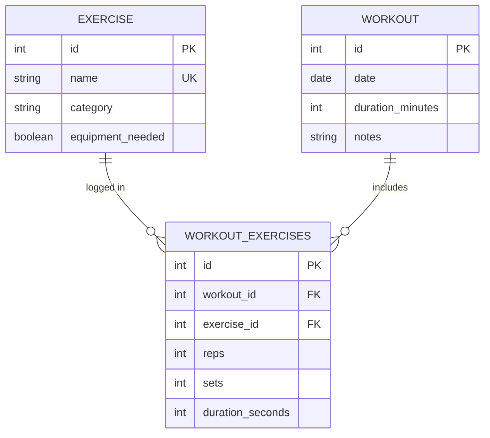

# FitBeat Backend

A Flask + SQLAlchemy REST API for logging workouts and the exercises performed in them.

## Tech Stack

- Python 3.12
- Flask 2.2.2, Flask-SQLAlchemy 3.0.3, Flask-Migrate 3.1.0
- Marshmallow 3.20.1 (serialization & validation)
- SQLite
- Pipenv

## Project Structure

```
fitbeat-backend/
├── Pipfile / Pipfile.lock
└── server/
    ├── app.py     # Flask app & routes
    ├── models.py  # SQLAlchemy models
    ├── schemas.py # Marshmallow schemas
    └── seed.py    # Database seed script
```

## Data Model

Three entities: `Exercise`, `Workout`, and `WorkoutExercises` — a join table (association object) that carries per-pairing data (reps, sets, duration) rather than a plain many-to-many table.



**Constraints & validation** (enforced at the DB, model, and schema layers):
- Exercise names are unique
- Workout `duration_minutes` must be > 0
- `reps` / `sets` / `duration_seconds` must be ≥ 0, and at least one is required when logging an exercise to a workout

## Setup

```bash
git clone -b dev https://github.com/shara-arch/fitbeat-backend.git
cd fitbeat-backend
pipenv install
pipenv shell
```

## Database

```bash
cd server
export FLASK_APP=app.py   # Windows: set FLASK_APP=app.py
flask db init
flask db migrate -m "Initial migration"
flask db upgrade
python seed.py             # optional: loads sample exercises & workouts
```

## Running

```bash
python server/app.py
```

API is served at `http://localhost:5555`.

## API Reference

| Method | Endpoint | Description | Success |
|---|---|---|---|
| GET | `/workouts` | List all workouts | 200 |
| GET | `/workouts/<id>` | Get a workout, with its exercises | 200 |
| POST | `/workouts` | Create a workout | 201 |
| DELETE | `/workouts/<id>` | Delete a workout (cascades to its exercise links) | 204 |
| GET | `/exercises` | List all exercises | 200 |
| GET | `/exercises/<id>` | Get an exercise, with its workouts | 200 |
| POST | `/exercises` | Create an exercise | 201 |
| DELETE | `/exercises/<id>` | Delete an exercise | 204 |
| POST | `/workouts/<workout_id>/exercises/<exercise_id>/workout_exercises` | Log an exercise within a workout | 201 |

Missing workouts/exercises return `404`; invalid payloads return `400` with a JSON `errors` object.

**Create a workout**
```bash
curl -X POST http://localhost:5555/workouts \
  -H "Content-Type: application/json" \
  -d '{"date": "2025-01-10", "duration_minutes": 45, "notes": "Leg day"}'
```

**Log an exercise in a workout**
```bash
curl -X POST http://localhost:5555/workouts/1/exercises/2/workout_exercises \
  -H "Content-Type: application/json" \
  -d '{"reps": 10, "sets": 3}'
```

### Request fields

| Model | Field | Type | Notes |
|---|---|---|---|
| Exercise | `name` | string | required, unique |
| | `category` | string | required |
| | `equipment_needed` | bool | optional, default `false` |
| Workout | `date` | `YYYY-MM-DD` | required |
| | `duration_minutes` | int | required, > 0 |
| | `notes` | string | optional |
| WorkoutExercises | `reps` | int | optional, ≥ 0 |
| | `sets` | int | optional, ≥ 0 |
| | `duration_seconds` | int | optional, ≥ 0 |

